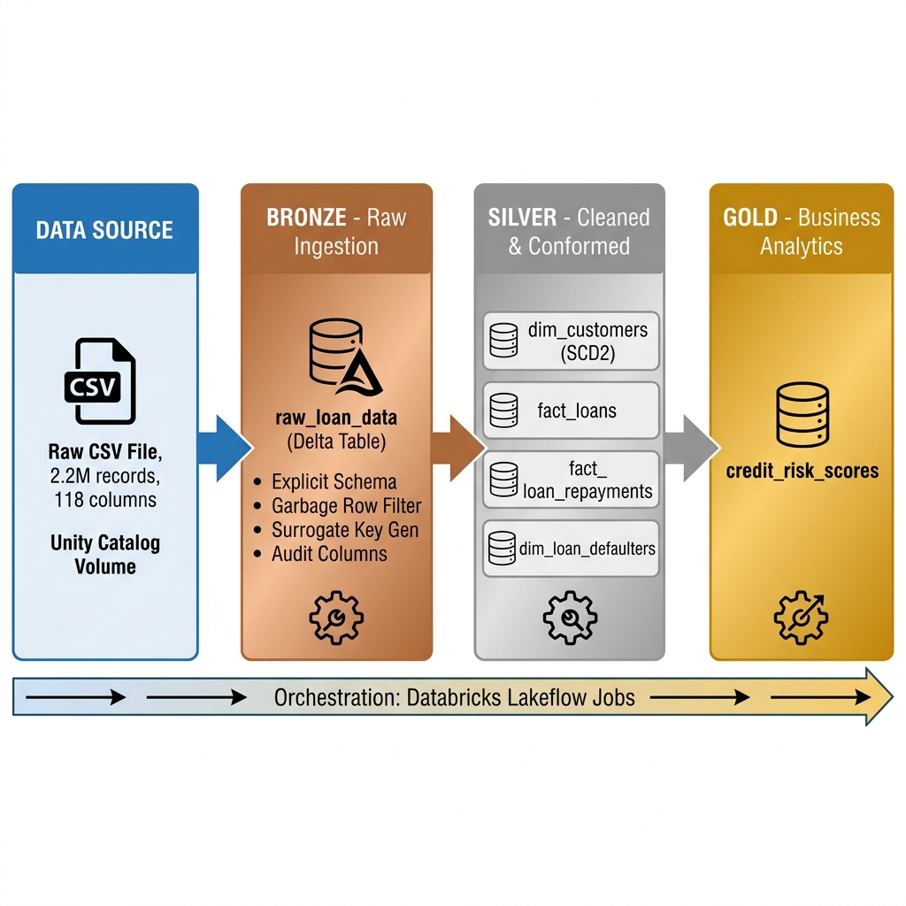
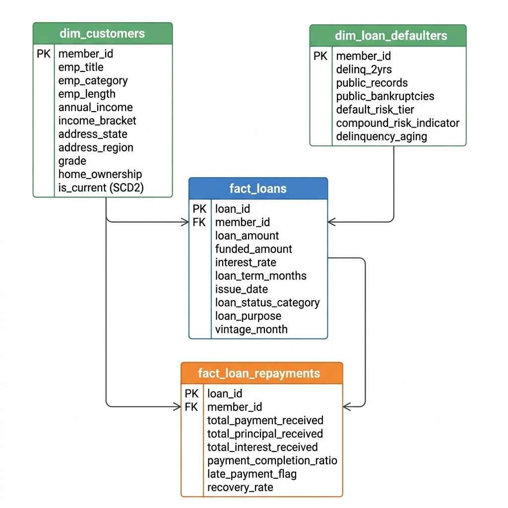

# Credit Risk Analytics

An end-to-end data engineering pipeline on **Azure Databricks** that processes **2.2M+ consumer loan records** through the **Medallion Architecture** (Bronze → Silver → Gold) using **PySpark**, **Delta Lake**, and **Unity Catalog**, producing credit risk scores for every borrower.

---

## Architecture



## Data Model



---

## What This Pipeline Does

| Stage | Input | Output | Key Operations |
|-------|-------|--------|---------------|
| **Bronze** | Raw CSV (2.2M rows, 118 cols) | `bronze.raw_loan_data` | Explicit schema, garbage row filter, SHA-256 surrogate key, audit columns |
| **Silver** | Bronze table | 4 Delta tables (2 dimensions, 2 facts) | SCD Type 2, employment title standardization, date parsing, income outlier capping, risk tiering, deduplication via window functions |
| **Gold** | All 4 Silver tables | `gold.credit_risk_scores` | Multi-criteria weighted scoring model → letter grade (A–F) per borrower |

### Silver Tables

| Table | Type | Description |
|-------|------|-------------|
| `dim_customers` | Dimension (SCD2) | Borrower profiles — 500K+ job titles standardized into 12 categories, validated states, income brackets |
| `fact_loans` | Fact | Loan details — parsed dates, normalized terms, interest rate bands, loan-to-income ratio |
| `fact_loan_repayments` | Fact | Payment records — completion ratios, late flags, recovery rates |
| `dim_loan_defaulters` | Dimension | Default history — risk tiers, delinquency aging, compound risk indicator |

---

## Tech Stack

| Component | Technology |
|-----------|-----------|
| Compute | Azure Databricks |
| Storage | Delta Lake (ACID, Time Travel) |
| Governance | Unity Catalog (3-level namespace) |
| Processing | PySpark 3.5+ |
| Orchestration | Databricks Lakeflow Jobs |
| Testing | Pytest |
| Language | Python 3.10+ |

---

## Project Structure

```
credit-risk-analytics/
├── notebooks/                        # Databricks notebooks
│   ├── 01_bronze_ingestion.py        # CSV → Bronze Delta table
│   ├── 02_silver_transformations.py  # Bronze → 4 Silver tables
│   ├── 03_gold_analytics.py          # Silver → Gold risk scores
│   └── 04_orchestrator.py            # Full pipeline runner
│
├── src/                              # Modular Python packages
│   ├── config/settings.py            # Centralized configuration
│   ├── ingestion/bronze_loader.py    # Bronze ingestion logic
│   ├── transformations/              # Silver transformers
│   │   ├── customer_transformer.py   # dim_customers (SCD2)
│   │   ├── loan_transformer.py       # fact_loans
│   │   ├── repayment_transformer.py  # fact_loan_repayments
│   │   └── defaulter_transformer.py  # dim_loan_defaulters
│   ├── analytics/
│   │   └── credit_risk_scorer.py     # Gold scoring engine
│   └── utils/
│       ├── spark_utils.py            # Spark utilities & UDFs
│       └── logger.py                 # Structured logging
│
├── tests/                            # Pytest unit tests
│   ├── conftest.py
│   └── test_customer_transformer.py
│
└── docs/                             # Documentation
    ├── architecture.md
    ├── project_flow.md
    ├── data_dictionary.md
    └── deployment_guide.md
```

---

## Quick Start

1. **Clone** the repo and connect it to Databricks (Workspace → Repos → Add Repo)
2. **Upload** the CSV to Volume: `/Volumes/credit_risk_analytics/bronze/landing/`
3. **Run** notebooks in order: `01` → `02` → `03`

See [Deployment Guide](docs/deployment_guide.md) for detailed setup instructions.

---

## Pipeline Orchestration

Orchestrated via **Databricks Lakeflow Jobs** as a 3-task DAG:

```
Bronze Ingestion  →  Silver Transforms  →  Gold Analytics
    (Task 1)            (Task 2)            (Task 3)
```

---

## Running Tests

```bash
pip install pyspark pytest
pytest tests/ -v
```

---

## 👤 Author

**Anantha Sai Jinde**  
Data Engineer  
[LinkedIn](https://www.linkedin.com/in/jinde-anantha-sai/) | [GitHub](https://github.com/Ananth-Jinde)
